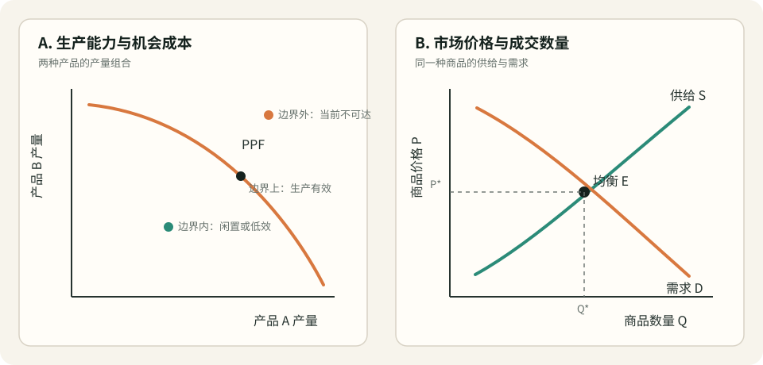

# 生产可能性边界与市场协调模型

## 现象（Observation）

- 在资源和技术给定的时期，一个经济体无法无限增加所有产品；增加一种产品，通常要放弃一部分其他产品。
- 同一种商品在价格较低时，消费者通常愿意且有能力购买更多；价格较高时，生产者通常愿意提供更多。价格偏离买卖双方计划相容的位置时，短缺或剩余会形成调整压力。
- 技术、劳动、资本或自然资源改变时，经济体的可生产集合会变化；收入、偏好、人口、替代品价格改变时，需求会变化。这两类变化可能都影响成交量，却不是同一种机制。
- 现实市场经常受到垄断、外部性、信息不对称、价格管制、交易成本和调整滞后的影响，因此“供需相交”不自动等于社会最优。

关键概念依据：

- OpenStax, *Principles of Economics 3e*，[机会成本与稀缺选择](https://openstax.org/books/principles-economics-3e/pages/2-1-how-individuals-make-choices-based-on-their-budget-constraint)。
- OpenStax, *Principles of Economics 2e*，[生产可能性边界与社会选择](https://openstax.org/books/principles-economics-2e/pages/2-2-the-production-possibilities-frontier-and-social-choices)。
- OpenStax, *Principles of Economics 3e*，[需求、供给与市场均衡](https://openstax.org/books/principles-economics-3e/pages/3-1-demand-supply-and-equilibrium-in-markets-for-goods-and-services)。
- OpenStax, *Principles of Economics 3e*，[供需变化的四步分析](https://openstax.org/books/principles-economics-3e/pages/3-3-changes-in-equilibrium-price-and-quantity-the-four-step-process)。

## 解释（Explanation）

这个模型包含三个相连但不可混同的层次：

1. **生产可能性边界（PPF）回答“能生产什么”。** 在资源、技术和制度能力给定时，可生产集合包含所有可实现的产品组合；其外缘是 PPF。边界上的点表示生产效率，边界内表示资源闲置或使用低效，边界外在当前条件下不可达。沿边界多生产一种产品所放弃的另一种产品，是边际机会成本。
2. **需求回答“消费者愿意且有能力买什么”。** 需求曲线描述其他条件不变时，不同价格对应的需求量；价格变化造成沿曲线移动，收入、偏好、人口、预期及替代品或互补品价格变化才会移动整条曲线。
3. **供给与市场均衡回答“生产计划和购买计划如何协调”。** 供给曲线描述不同价格下生产者愿意提供的数量，受投入成本、技术、产能、预期和卖方数量影响。供需相交处表示计划成交量一致；短缺通常形成涨价压力，剩余通常形成降价或减产压力。

它们的连接机制是：PPF 所体现的资源稀缺和机会成本，约束生产者能够提供多少以及追加产出的成本，因此构成供给面的深层约束；需求把偏好与购买力转化为市场信号；价格再协调分散的生产与消费计划。只有在竞争、信息、产权和外部性等条件足够接近理想状态时，市场均衡才可能把经济体引向 PPF 上较符合支付意愿的组合。

**重要修正：PPF 不记录需求与供给的关系。** PPF 的两条轴通常是两种产品的产量；供需图的两条轴则是同一种产品的价格与数量。需求变化在短期内可以改变价格、成交量和资源使用点，却不必移动 PPF；技术或资源变化可以移动 PPF，并经由成本或产能改变供给。

**主要替代解释：** 数量和价格也可能由行政配给、议价权、垄断定价、习俗、平台规则或长期合约决定；观察到的低产出可能源于需求不足或协调失败，而不是生产能力不足；观察到的价格上涨也可能来自市场势力而非资源稀缺。

## 世界模型（Model）

**一句话描述：** 资源和技术决定“能生产什么”的边界及机会成本，消费者偏好与购买力形成需求，生产者依据价格和成本形成供给，价格在制度约束下协调双方计划；PPF 约束供给能力，但不等于供需关系。

可用三组关系表示：

`可生产集合 F = f（资源、技术、制度能力）；PPF = F 的有效边界`

`需求量 Qd = D（价格；收入、偏好、人口、相关商品价格、预期）`

`供给量 Qs = S（价格；投入成本、技术、产能、卖方数量、预期），均衡条件为 Qd = Qs`

### 关键图形

#### 图 1：生产可能性边界与供需图是两个不同层次

> **图注：** 左图回答资源与技术给定时“两种产品能如何组合”，边界斜率表示边际机会成本；右图回答“同一种商品在不同价格下的供给量与需求量如何协调”。需求变化可以移动右图的需求曲线，却不必移动左图的 PPF；技术或资源变化可以移动 PPF，并可能进一步改变供给。

### 关键变量

| 变量 | 含义 | 可观察指标 | 对结果的方向 |
|---|---|---|---|
| 资源禀赋 | 可投入生产的劳动、资本、土地、能源和时间 | 工时、设备、土地、原料、能源可得量 | 增加通常使 PPF 外移并扩大潜在供给 |
| 技术与生产率 | 相同投入能够转化出的产出 | 单位工时产出、全要素生产率、良率 | 提升通常使相关方向的 PPF 外移、供给右移 |
| 边际机会成本 | 多生产一单位产品所放弃的次优产出 | PPF 局部斜率、替代产量、边际成本 | 越高，追加供给通常越困难 |
| 商品价格 | 买方支付、卖方获得的单位交换比率 | 市场成交价 | 上升通常减少需求量、增加供给量，但不自动移动曲线 |
| 需求条件 | 偏好、购买力及买方规模 | 收入、人口、搜索量、订单、支付意愿 | 增强使需求曲线右移 |
| 供给条件 | 成本、产能及卖方竞争状态 | 投入价格、库存、产能利用率、卖方数量 | 成本下降或产能增加使供给曲线右移 |
| 制度与市场摩擦 | 价格能否反映信息并促成交换 | 税费、管制、交易成本、市场集中度、信息差 | 摩擦越大，均衡调整越慢且越可能偏离社会效率 |

### 核心假设

- 分析期内能够近似给定资源、技术和制度条件，并把它们变化造成的效应单独识别。
- 商品、时间范围和市场边界定义清楚；需求和供给比较的是同一商品、同一时期的数量。
- 价格变化与曲线移动被区分，其他条件不变只是一种局部分析工具。
- 买卖双方会对价格和稀缺信号作出方向上相对稳定的反应，但不要求完全理性。
- 将市场均衡解释为效率时，需另加竞争充分、外部性较小、信息较充分和产权清晰等条件。

### 适用范围

- 理解稀缺、选择、机会成本、产能、需求、供给和价格形成之间的基础关系。
- 区分产能冲击、成本冲击和需求冲击，并预测价格与数量的变化方向。
- 评估技术投资、资源约束、税收补贴、价格管制及产能扩张的第一轮影响。
- 作为微观经济分析的起点，而不是对复杂现实市场的完整描述。

### 失效条件

- 商品质量快速变化或产品不可比，使“数量”无法稳定定义。
- 垄断、平台规则、配给或价格管制主导成交，价格不承担常规清算功能。
- 外部性、公共品或公共资源使私人供需不能反映全部社会成本与收益。
- 严重信息不对称、非理性、信用约束或交易成本使支付意愿和真实需要明显分离。
- 生产存在长周期、不可逆投资、网络效应或多重均衡，静态曲线不能描述路径依赖。
- 把边界内的低产出一律解释为生产无效率，而忽略失业、需求不足、协调失败或主动保留冗余。

### 决策含义

- 先判断问题发生在哪一层：是生产能力边界变化、供给成本变化，还是需求条件变化。
- 画图前先检查坐标轴：两种产品的数量对应 PPF；一种产品的价格与数量对应供需图。
- 分析事件时只移动直接受影响的曲线，再沿因果链判断均衡价格和数量；不要因为成交量变化就同时移动所有曲线。
- 将 PPF 内的点视为诊断信号而非自动结论，继续检查资源闲置、需求不足、制度摩擦和韧性储备。
- 将“市场达到均衡”和“结果公平或社会最优”分开评价；必要时加入外部性、分配和市场势力分析。

## 与其他模型的关系（Connections）

- **支持：** `WM-02-001 飞轮效应模型`描述能力、数据、资本等存量如何累积。若这些存量提高生产率，它们会使本模型中的 PPF 外移或供给曲线右移；若只扩大需求或依赖补贴，则不会自动扩大生产边界。
- **冲突：** 当前系统暂无正式的垄断、外部性或行为经济学市场模型；这些未来模型可能对“价格能有效协调市场”的强版本构成限制或替代解释。
- **约束：** PPF 只给出可行集合，不决定社会偏好；供需均衡只表示买卖计划相容，不自动证明生产效率、配置效率、公平或可持续。
- **可合并：** 若未来分别建立机会成本模型、供需模型或市场失灵模型，本模型应保留为总览和概念连接层，具体机制下沉至子模型。

## 预测（Prediction）

| 可证伪预测 | 时间范围 | 观察指标 | 证伪条件 | 结果 |
|---|---|---|---|---|
| 在需求条件近似不变时，相关生产技术提升会降低单位成本，使供给右移，并扩大至少一种产品的可生产上限 | 一个生产或投资周期 | 单位成本、产能、价格、成交量、最大可行产出 | 技术确实提高物理生产率，但单位成本、供给能力和可生产上限均无变化 | 待验证 |
| 在 PPF 和供给条件短期不变时，需求增加会提高成交量并通常推高价格，但不会立刻提高技术上可实现的最大产出 | 数日至一个生产周期 | 订单、价格、产量、产能上限 | 仅由需求变化即可持续提高单位投入产出或物理产能上限 | 待验证 |
| 当市场价格被约束在均衡价以下且约束有效时，需求量将超过供给量，表现为排队、缺货或非价格配给 | 管制实施后的一个交易周期 | 缺货率、等待时间、供需量、转售价格 | 在无新增供给或需求下降时，持续不存在任何短缺或非价格配给 | 待验证 |
| 当一种关键投入变得稀缺时，依赖该投入的产品边际机会成本上升，供给收缩，并促使资源或需求转向替代品 | 一个采购至生产周期 | 投入价格、产品供给、替代品销量、PPF 局部斜率 | 投入稀缺被确认，但相关边际成本、供给和替代行为长期均不变化 | 待验证 |

## 可信度（Confidence）

**★★★★☆**

- **支持证据：** 稀缺、机会成本、生产边界以及供需均衡是能够清晰定义、广泛观察并进行局部检验的基础经济机制；技术、成本、需求冲击和价格管制的方向性预测有大量重复经验支持。
- **降低可信度的证据：** 简单二维曲线压缩了产品异质性、时间、预期、权力、制度和分配；均衡可能不唯一，也可能长期不被达到。PPF 通常难以直接观测，只能根据数据和假设估计。
- **当前判断：** 对“资源约束产生机会成本、供需共同决定市场价格与成交量”的弱版本给高可信；对“市场会快速达到唯一且有效率的均衡”的强版本只给中低可信，因此综合为四星活跃模型。
- **提高可信度所需证据：** 在具体市场中预先识别冲击属于需求、供给还是生产边界后，能够稳定预测价格、数量、成本和产能的联合变化。
- **降低可信度所需证据：** 在大量边界清晰、摩擦较小的市场中，方向明确的成本或需求冲击仍系统性地产生与模型相反的结果。

## 修订记录

| 日期 | 变更类型 | 变更内容 | 原因/证据 |
|---|---|---|---|
| 2026-08-21 | 新模型、修正 | 创建模型并明确区分 PPF、供给、需求和均衡；将 PPF 定位为供给能力的深层约束，而非供需关系图 | 用户希望把相关经济概念加入世界地图，但原表述把 PPF 与供需关系混为一体 |
| 2026-08-21 | 旧模型更新 | 新增“生产可能性边界与供需图是两个不同层次”关键图形及图注 | 提高模型的可视化辨识度，避免混淆两类图的坐标和问题边界 |

## 世界地图更新（World Map Update）

- **更新地图：** 03 Business / Economics
- **删除：** 无
- **新增：** WM-03-001 生产可能性边界与市场协调模型
- **修改：** 模型关键图形、03 Business 模型索引、全局模型注册表、连接索引、2026-08 演化日志、网页数据
