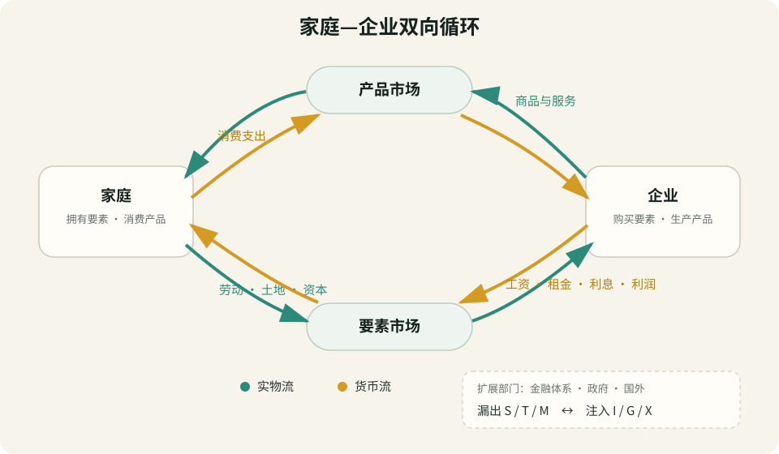

# 经济循环流量模型

## 现象（Observation）

- 家庭从企业获得工资、利息、租金和利润，又用收入购买商品与服务；家庭的消费支出成为企业收入，企业的要素支出又成为家庭收入。
- 每笔市场交易通常同时包含方向相反的两种流：商品、服务或生产要素的**实物流**，以及付款、工资或其他收入的**货币流**。
- 从整个经济体核算，同一项最终产出可从生产、收入和支出三个侧面观察；理论上三者对应，实际统计会因数据来源、覆盖和时间差异出现统计误差。
- 家庭并不会花掉全部收入，企业也不会只依赖当期销售；储蓄、投资、税收、政府支出、进口和出口使简单的家庭—企业闭环扩展为金融、政府与国外部门共同参与的网络。
- 货币仍在账户间流动，不代表实际产出或就业必然不变。支出突然减少且没有其他支出补位时，企业可能先累积非计划库存，随后削减生产与用工。

关键概念依据：

- OpenStax, *Principles of Macroeconomics 3e*，[循环流量图：家庭、企业、产品市场与要素市场](https://openstax.org/books/principles-macroeconomics-3e/pages/1-3-how-economists-use-theories-and-models-to-understand-economic-issues)。
- OpenStax, *Introduction to Business*，[包含政府部门的经济循环流量](https://openstax.org/books/introduction-business/pages/1-3-how-business-and-economics-work)。
- U.S. Bureau of Economic Analysis，[国民收入与生产账户入门](https://www.bea.gov/sites/default/files/methodologies/nipa_primer.pdf)。
- U.S. Bureau of Economic Analysis，[GDP 的支出法及 `C + I + G + X − M`](https://bea.gov/index.php/news/blog/2025-06-03/expenditures-approach-measuring-gdp)。

## 解释（Explanation）

### 基础的两部门循环

循环流量图把经济活动压缩为家庭、企业与两类市场：

1. **要素市场：** 家庭向企业提供劳动、土地、资本和企业家能力等生产要素；企业向家庭支付工资、租金、利息和利润。实物流由家庭流向企业，货币收入反向流回家庭。
2. **产品市场：** 企业向家庭提供商品与服务；家庭以消费支出支付企业。实物流由企业流向家庭，货币支出反向流回企业。

企业将投入转化为产出，销售收入为下一轮生产提供支付能力；家庭提供要素取得收入，再用收入购买产出。因此，一方的支出是另一方的收入，一方的销售是另一方的购买。这个闭环展示的是部门相互依赖，而不是永动机：实际循环仍受生产能力、需求、信用、价格、制度和预期约束。

### 扩展的多部门循环

- **金融体系：** 家庭或企业未消费的收入形成储蓄，金融机构和资本市场把部分资金转化为企业投资、住房投资或政府融资。储蓄是货币流的暂时“漏出”，投资是重新进入产品与收入循环的“注入”；二者的连接会受到信用风险、利率、资产负债表和预期影响。
- **政府部门：** 税收从私人可支配收入中漏出，政府购买和转移支付把资金重新注入其他部门。转移支付改变收入分配，但由于没有对应的当期产出，不直接计入 GDP 的政府购买。
- **国外部门：** 出口把国外支出注入国内生产者，进口使国内支出流向国外生产者。进口同时带来商品或服务的实物流入，不能只理解为“损失”。

### 核算恒等式与行为因果

在定义和边界一致时，当期国内最终产出的支出恒等式为：

`Y = C + I + G + X − M`

其中 `Y` 为国内生产总值，`C` 为消费，`I` 为投资，`G` 为政府购买，`X` 为出口，`M` 为进口。生产创造的增加值同时形成工资、利润等收入，因此产出、总收入和总支出在概念上是同一经济活动的三个核算侧面。

但恒等式本身不说明因果方向，也不保证计划一致。企业没卖出的新增产出会作为库存投资进入核算，所以“实际投资与实际储蓄相等”可以在非计划库存增加、产出下降或收入调整后成立。要解释经济为何扩张或收缩，必须另加消费倾向、投资预期、财政政策、货币与信用条件等行为机制。

**主要替代解释：** 以部门净额绘制的循环图会隐藏企业间交易、家庭内部生产、资产价格变化、存量财富、债务链条和非市场活动；投入产出表、资金流量表、部门资产负债表和网络模型能提供更细的结构解释。

## 世界模型（Model）

**一句话描述：** 经济活动由方向相反的实物流与货币流连接：家庭提供生产要素并取得收入，企业生产商品与服务并取得支出；储蓄、税收和进口形成漏出，投资、政府支出和出口形成注入，流量失配会通过库存、产出、就业、价格或资产负债表调整。

基础闭环可以压缩为：

`家庭提供要素 → 企业生产 → 企业提供产品 → 家庭消费`

`家庭获得收入 ← 企业支付要素报酬 ← 企业获得销售收入 ← 家庭支付消费支出`

扩展经济中的计划流量平衡条件可写为：

`计划漏出 S + T + M = 计划注入 I + G + X`

若计划流量不相等，实际核算仍会通过非计划库存、收入、产出、价格或融资变化实现事后相等。

### 关键图形

#### 图 1：家庭与企业之间的双向循环流量

> **图注：** 绿色箭头表示商品、服务或生产要素的实物流，黄色箭头表示方向相反的货币流。基础图只画家庭与企业；金融体系、政府和国外部门分别通过 `S/I`、`T/G`、`M/X` 扩展循环。图中“闭环”表示交易对应关系，不表示支出会自动充分、经济会自动达到充分就业，也不表示 GDP 等于福利。

### 关键变量

| 变量 | 含义 | 可观察指标 | 对结果的方向 |
|---|---|---|---|
| 家庭消费 `C` | 家庭购买最终商品和服务的支出 | 零售、服务消费、个人消费支出 | 增加通常提高企业收入和短期总支出 |
| 要素收入 | 生产产生的工资、租金、利息与利润 | 劳动报酬、经营盈余、财产收入 | 增加可提高家庭购买力和储蓄能力 |
| 储蓄 `S` | 当期收入中未用于消费的部分 | 家庭与企业净储蓄、储蓄率 | 若未转化为等量注入，会形成支出漏出 |
| 投资 `I` | 新增资本品、住宅和库存的支出 | 固定资本形成、住宅投资、库存变化 | 注入当期支出并可能扩大未来产能 |
| 税收 `T` 与政府支出 `G` | 政府从私人部门取得及向经济支出的流量 | 税收收入、政府购买、转移支付 | 净效应取决于规模、对象、融资与乘数 |
| 出口 `X` 与进口 `M` | 国内与国外部门之间的产品和货币流 | 贸易数据、净出口 | 出口增加国内支出；进口满足国内需求但从 GDP 支出项中扣除 |
| 信用与金融传导 | 储蓄能否转为融资和实际投资 | 利率、贷款、信用利差、融资可得性 | 传导顺畅时减少漏出与注入的计划失配 |
| 库存变化 | 生产与销售暂时不一致形成的缓冲 | 库存销售比、非计划库存 | 意外增加通常预示减产压力，下降则可能预示补库存 |

### 核心假设

- 部门、地域、时期以及最终产品和中间投入的核算边界保持一致。
- 每项货币支付能够识别付款方与收款方，并与相应交易或转移区分。
- 名义货币流和实际商品、服务及要素流被分别观察，不把价格上涨误当作实际产出增加。
- 用恒等式做核算时允许非计划库存和统计误差；用模型做预测时另行声明行为假设。
- 简图中的“家庭”和“企业”代表部门汇总，不表示部门内部所有主体行为相同。

### 适用范围

- 理解家庭收入、企业收入、消费、就业和生产为何相互依赖。
- 学习 GDP 的生产法、收入法和支出法为何在概念上对应。
- 分析储蓄、投资、财政、贸易或信用变化通过哪些部门传导。
- 检查一项政策或商业冲击的直接付款方、收款方、实物流和后续反馈。

### 失效条件

- 用简单两部门图解释包含政府、金融体系和国际贸易的现实经济，却未显式加入这些部门。
- 把会计恒等式误作行为规律，例如从“实际储蓄等于实际投资”推出储蓄意愿上升必然自动带来投资上升。
- 忽略银行信用创造、债务违约、资产价格和存量资产负债表，导致金融危机或去杠杆过程无法解释。
- 忽略家庭内部劳动、志愿活动、生态损耗、收入分配和生活质量，把 GDP 或货币流量当作社会福利。
- 混淆名义流量和实际流量，无法区分价格上涨与产量增长。
- 部门净额掩盖关键网络集中度，使同样的总流量对应完全不同的脆弱性。

### 决策含义

- 分析任何交易或政策时画出四项：谁向谁支付、谁向谁提供实物或服务、资金是否停留、下一轮由谁支出。
- 看到某部门“节省成本”时，检查这是否同时减少另一部门收入；局部最优不一定等于总体流量稳定。
- 将漏出与注入分开监测：消费下降是否被投资、政府购买或净出口补位，储蓄是否真正转化为新增资本形成。
- 用库存销售比、订单、工时和就业识别计划支出不足，而不能只看银行账户中的货币是否仍存在。
- 评估 GDP 时同时查看实际量、人均值、分配、资产负债表和未计价活动，避免把核算规模等同于福利。

## 与其他模型的关系（Connections）

- **组成：** `WM-03-001 生产可能性边界与市场协调模型`解释单个产品市场及生产约束；本模型把产品市场与要素市场连接为跨部门循环。产品需求成为企业收入，要素需求又成为家庭收入，两者共同影响资源实际使用点。
- **支持：** 当投资提高资本存量和生产率时，循环流量中的当期投资注入会在未来使 `WM-03-001` 的 PPF 外移；投资只有货币支出而未形成有效资本时，不会自动扩大边界。
- **约束：** 循环流量是核算与传导框架，不单独决定价格、产量、分配或福利；这些结果还受供需、生产能力、权力和制度影响。
- **可合并：** 若未来建立国民收入核算、总需求—总供给或存量—流量一致模型，本模型保留为入口，具体核算与动态机制下沉至相应模型。

## 预测（Prediction）

| 可证伪预测 | 时间范围 | 观察指标 | 证伪条件 | 结果 |
|---|---|---|---|---|
| 在核算范围和定义一致时，最终产出的价值、由生产产生的总收入和最终支出应大体对应，差额主要表现为可追踪的统计误差 | 每个统计期 | GDP、GDI、支出法 GDP、统计误差 | 长期存在无法由定义、覆盖、时间或测量误差解释的巨大差额 | 待验证 |
| 家庭消费突然下降且投资、政府购买和净出口没有补位时，企业会先出现非计划库存上升，随后降低生产或就业 | 数周至数季 | 消费、订单、库存销售比、工时、就业、产出 | 支出持续下降且无其他注入，但库存、产出和就业长期完全不调整 | 待验证 |
| 信贷收紧会削弱储蓄向投资的传导，使融资敏感企业的投资下降幅度大于内部现金充足企业 | 一个信贷至投资周期 | 信用利差、贷款量、资本开支、企业现金 | 信贷显著收紧后，融资依赖度与投资变化长期无系统关系 | 待验证 |
| 政府购买增加的直接第一轮效果，会同时增加供应方企业收入和计入 GDP 的最终支出 | 支付发生的统计期 | 政府购买、承包商收入、产出核算 | 合格的新增政府最终购买既未形成收款方收入，也未进入任何生产或支出记录 | 待验证 |
| 出口增加在其他条件不变时会向国内循环注入国外支出；进口增加会带来实际商品或服务流入，并从国内 GDP 支出核算中扣除 | 一个贸易统计期 | 出口、进口、企业收入、净出口、国内产出 | 交易边界正确且数据完整时，跨境实物流与相应支付长期没有对应关系 | 待验证 |

## 可信度（Confidence）

**★★★★☆**

- **支持证据：** 双重记账与国民经济核算为生产、收入和支出的对应关系提供高可信基础；家庭、企业、政府和国外部门之间的支付与实物流可以直接记录。
- **降低可信度的证据：** 简图高度聚合，无法独立解释行为、因果方向、金融信用创造、分配或网络脆弱性；现实 GDP 与 GDI 会因采样、覆盖和时间差异出现统计差额。
- **当前判断：** 对“支出—收入对应、实物流与货币流反向、三种 GDP 核算概念一致”的核算骨架给高可信；对“流量失配会按某条固定路径和幅度调整”的行为版本只给中等可信，因此综合为四星活跃模型。
- **提高可信度所需证据：** 部门级交易、资金流量和投入产出数据能够在多个周期闭合，并使库存、投资、就业等变量按预先指定的传导顺序变化。
- **降低可信度所需证据：** 在边界一致且数据充分时，交易对手关系无法闭合，或模型所列流量对生产和收入变化持续没有任何预测增益。

## 修订记录

| 日期 | 变更类型 | 变更内容 | 原因/证据 |
|---|---|---|---|
| 2026-08-21 | 新模型、新连接 | 创建家庭—企业基础循环及金融、政府、国外部门扩展；区分实物流、货币流、核算恒等式与行为因果 | 用户希望将经济学循环流量图加入世界地图，现有模型尚未覆盖跨部门收入与支出的循环机制 |
| 2026-08-21 | 旧模型更新 | 新增家庭—企业双向循环关键图形，以颜色区分实物流与货币流，并补充简化边界图注 | 让收入、支出、产品与要素之间的反向流动能够被直接识别 |

## 世界地图更新（World Map Update）

- **更新地图：** 03 Business / Economics
- **删除：** 无
- **新增：** WM-03-002 经济循环流量模型
- **修改：** 模型关键图形、03 Business 模型索引、全局模型注册表、连接索引、2026-08 演化日志、网页数据
