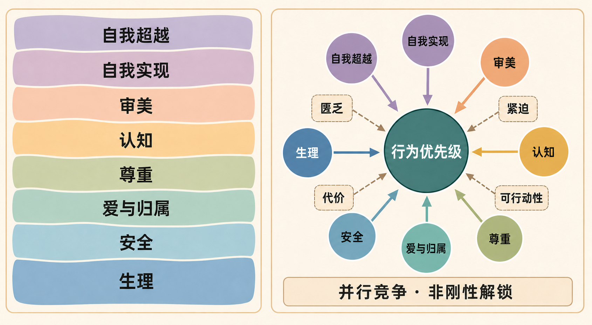

# 马斯洛需求层次模型

## 现象（Observation）

- **观察事实：** 人在饥饿、疼痛、暴力威胁或居所不稳定等严重匮乏状态下，注意力和行为通常会更多转向缓解这些紧迫状态。
- **理论原始主张：** Maslow（1943）将基本需要概括为生理、安全、爱与归属、尊重、自我实现五组，并提出它们具有“相对优势性”的层次关系：较具优势的需要得到一定满足后，其他需要更可能成为动机中心。原文也承认层次并非完全固定，并存在倒序和多重动机。
- **后续扩展事实：** Maslow 在后续著作中另行讨论了“求知—理解”的认知需要和审美需要；晚期又区分普通自我实现者与具有超越体验、由存在价值驱动的“超越者”。因此，五层、七层和八层图通常来自不同时期观点的不同组合，并非三套互不相干的理论。
- **跨国数据：** Tay 与 Diener（2011）对 123 个国家的研究发现，各类需要满足均与主观幸福感相关；但某类需要带来的幸福感关联，大体不以其他需要已经满足为前提。这支持“需要很重要”，却不支持严格逐级解锁。
- **反证与局限：** 既有研究综述没有为五层固定顺序、低层满足后高层才出现的强版本提供稳定支持；层级操作化、文化差异和自我实现的测量也存在困难。

关键证据：

- Maslow, A. H. (1943), [A Theory of Human Motivation](https://doi.org/10.1037/h0054346), *Psychological Review*, 50(4), 370–396。
- Maslow, A. H. (1970), *Motivation and Personality*（2nd ed.），尤其第 48–51 页关于认知需要和审美需要的讨论。
- Maslow, A. H. (1969), *Theory Z* 与 *Various Meanings of Transcendence*，*Journal of Transpersonal Psychology*, 1。
- Tay, L. & Diener, E. (2011), [Needs and Subjective Well-Being Around the World](https://pubmed.ncbi.nlm.nih.gov/21688922/), *Journal of Personality and Social Psychology*, 101(2), 354–365。
- Wahba, M. A. & Bridwell, L. G. (1976), [Maslow Reconsidered: A Review of Research on the Need Hierarchy Theory](https://doi.org/10.1016/0030-5073(76)90038-6), *Organizational Behavior and Human Performance*, 15(2), 212–240。
- Koltko-Rivera, M. E. (2006), [Rediscovering the Later Version of Maslow's Hierarchy of Needs](https://doi.org/10.1037/1089-2680.10.4.302), *Review of General Psychology*, 10(4), 302–317。

## 解释（Explanation）

**机制解释：** 需求未被满足时会产生匮乏信号；信号的生存代价、即时性和可行动性共同提高该需求在注意、选择与资源分配中的权重。严重且迫近的生理或安全风险通常具有更高机会成本，因此常压过远期目标。某类需求得到“足够”而非完全满足后，其边际动机强度下降，其他需求更容易进入行为竞争。

### 版本谱系：五层、七层与八层

| 常见版本 | 构成 | 与原始五类的关系 | 证据与归属判断 |
|---|---|---|---|
| 五层核心版 | 生理 → 安全 → 爱与归属 → 尊重 → 自我实现 | 1943 年的基本需要/意动需要主干 | 最接近原始公开理论，但箭头应理解为“相对优先”，不是刚性通关 |
| 七层扩展版 | 五层中的前四层 → 认知 → 审美 → 自我实现 | 在尊重和自我实现之间加入两类成长性需要 | Maslow 确实讨论过认知和审美需要；但他称认知需要具有自己的小层级，并说它与基本需要层级相互关联，审美需要又与认知及其他需要重叠。因此，精确的七级直线排位主要是后来的教学性综合 |
| 八层合成版 | 七层版 → 自我超越 | 在自我实现之上加入指向超越自我、服务更大目的或存在价值的需要 | 自我超越有晚期 Maslow 文本依据；把它与七层版合成一座八层金字塔，是后续研究者对其思想发展的回溯性重构，而非 Maslow 一次性发表的标准图 |

附图对应第三种“八层合成版”：生理、安全、爱与归属、尊重四层保持不变；原第五层自我实现被上移，认知与审美插入其前，自我超越再加在其后。

不同资料还可能出现六层或九层：六层通常只在五层版之上添加自我超越；九层通常把“求知”和“理解”拆成两层。层数变化主要来自**是否计入认知、审美、自我超越，以及如何合并认知需要**，而不是发现了完全不同的一组底层机制。

### 各类需求的含义

原始五类需求可作为核心诊断清单：

1. **生理：** 食物、水、睡眠、体温调节等维持机体运行的条件。
2. **安全：** 人身、健康、资源与环境的稳定和可预测性。
3. **爱与归属：** 亲密关系、友谊、接纳与群体联结。
4. **尊重：** 能力感、自尊、认可、地位与他人尊重。
5. **自我实现：** 实现自身潜能、创造、成长和追求有意义目标。

扩展类别为：

- **认知需要：** 求知、理解、解释、组织信息和寻找意义。Maslow 还提出“求知”通常先于“理解”，形成一个小型认知层级。
- **审美需要：** 对美、秩序、对称、完整与和谐的追求；Maslow 明确承认它与认知需要及其他需要难以清晰分开。
- **自我超越：** 超出个人潜能实现本身，把动机指向他人、共同体、使命、真善美等存在价值，或统一性与超越性体验。它不是“更成功的自我实现”，而是动机对象从强化自我转向超越自我。

这些类别在不同版本中的层号并不固定，也不表示八类需求已经获得严格顺序的实证确认。

**主要替代解释：** 自我决定理论用自主、胜任和关系三类基本心理需要解释动机；资源稀缺与认知带宽模型可解释紧迫匮乏为何占据注意；文化规范、个人价值和生命周期也能解释需求优先级差异，而不要求统一层级。

## 世界模型（Model）

**一句话描述：** 人的多类需求会同时竞争行为控制权；越匮乏、越紧迫且代价越高的需求通常越优先，但不存在对所有人和情境都成立的五层刚性解锁顺序。

可压缩为启发式关系：

`需求的动机优先级 ≈ 匮乏程度 × 紧迫性 × 未满足代价 × 可行动性，并受文化、个体价值和情境调节`

### 关键图形

#### 图 1：需求类别的层级谱系与并行竞争机制

> **图注：** 左侧用于识别常见八层合成版的类别谱系，不表示 Maslow 一次性定稿了这座八层金字塔；右侧表达本模型采用的弱机制：多类需求可以同时竞争行为控制权，匮乏、紧迫性、未满足代价与可行动性共同改变其权重。图中省略了文化、个体价值、生命阶段及需求间重叠，不应据此推出普遍的刚性逐级解锁顺序。

### 关键变量

| 变量 | 含义 | 可观察指标 | 对结果的方向 |
|---|---|---|---|
| 需求匮乏程度 | 当前状态与主观“足够”阈值的差距 | 饥饿、睡眠不足、孤独感、财务不安全感量表 | 越高，通常越优先 |
| 紧迫性 | 不行动造成损失的时间距离 | 威胁发生概率、可延迟时间、危机程度 | 越高，通常越优先 |
| 未满足代价 | 继续匮乏对生存、功能或身份的损害 | 健康损失、失业风险、关系破裂、功能受损 | 越高，通常越优先 |
| 满足水平 | 某需求当前被满足的程度 | 资源可得性、稳定性、主观满足评分 | 越高，该需求边际动机通常越低 |
| 可行动性 | 个体是否相信行动能改善该需求 | 控制感、资源、路径清晰度、预期成功率 | 越高，越可能转化为行动 |
| 调节因素 | 文化、价值观、人格、年龄与角色责任 | 价值排序、文化背景、生命阶段 | 改变需求权重与顺序 |

### 核心假设

- 至少部分需求匮乏能够被个体感知，并改变注意与行为权重。
- 需求满足存在边际效用递减；“足够”是连续阈值，不是全有或全无。
- 生理和安全威胁在多数情境中平均具有更高优先级，但不是不可被价值、关系或长期目标覆盖。
- 五类需求是原始主干而非完备清单；认知、审美和自我超越能补充成长动机，但类别之间可能重叠。

### 适用范围

- 用作个人、团队、产品或组织情境中的动机诊断清单。
- 判断严重匮乏为何压低人们对成长、学习或长期目标的投入。
- 生成需要进一步验证的干预假设，不作为临床诊断或个体行为的确定性解释。

### 失效条件

- 将五层解释为任何人都必须完全满足低层后才能追求高层。
- 用群体平均倾向直接预测单个个体，忽略文化、价值、牺牲、照护责任和生命阶段。
- 行为主要由习惯、制度强制、短期激励、成瘾、疾病或信息缺失驱动，而非需求匮乏。
- “满足程度”或“自我实现”无法独立测量，导致模型只能事后解释、不能证伪。

### 决策含义

- 先识别当前最匮乏、最紧迫、代价最高且可干预的需求，不要机械地从金字塔底层逐级检查。
- 使用模型时注明采用五层核心版、七层扩展版还是八层合成版；不同版本不能共享同一个未经说明的层级预测。
- 当生理或安全风险严重时，优先降低风险和恢复可控性；只提供愿景、认可或成长机会往往不足。
- 当基本条件已达到“足够”水平时，继续增加物质保障的边际激励可能下降，应同时检验归属、尊重、自主、胜任与意义。
- 设计产品或政策时分别测量多类需求，因为改善一种需求不能保证其他需求自动改善。

## 与其他模型的关系（Connections）

- **支持：** 当前系统暂无可建立正式支持关系的模型。
- **冲突：** 当前系统暂无正式竞争模型；未来若加入自我决定理论，应比较“普遍心理需要”与“固定层级”两种预测。
- **约束：** 本模型的强层级版本受文化差异、个体价值和需求可并行满足的证据约束。
- **可合并：** 若未来建立统一的“需求竞争与动机优先级模型”，可将五类需求作为分类层吸收，而非保留刚性金字塔机制。

## 预测（Prediction）

| 可证伪预测 | 时间范围 | 观察指标 | 证伪条件 | 结果 |
|---|---|---|---|---|
| 在同一个体内，突发且严重的生理或安全匮乏会提高与其直接相关任务的选择比例，并挤压多数非紧迫成长任务 | 小时至数周 | 任务选择、注意时长、支出结构、主观优先级 | 控制可行动性和既有承诺后，匮乏加重未引起相关任务权重上升 | 待验证 |
| 当某类需求从严重匮乏改善到“足够”时，继续投入该需求的边际幸福感增益下降 | 数周至一年 | 需求满足评分与幸福感的非线性关系 | 增益在完整观测区间持续不下降或上升 | 待验证 |
| 归属、尊重或成长需要的满足可以在低层需求未完全满足时独立改善部分幸福感 | 数周至一年 | 正向情绪、生活评价、孤独感、意义感 | 只有低层完全满足后，高层满足才与任何幸福感指标相关 | 已有跨国数据初步支持 |
| 不同文化与生命阶段的五类需求排序存在系统差异，刚性五层顺序的个体级预测准确率有限 | 一年至数年 | 跨文化纵向需求排序、行为选择 | 多文化纵向数据持续呈现近乎一致的严格五层顺序 | 待验证 |

## 可信度（Confidence）

**★★☆☆☆**

- **支持证据：** 需求满足与幸福感、严重匮乏与注意优先级之间存在广泛观察支持；五类需求作为访谈和诊断清单具有较强启发价值。
- **降低可信度的证据：** 严格五层顺序缺乏稳定实证支持，各类需求可以同时发挥作用；“自我实现”等构念边界和测量较弱。
- **当前判断：** 对“多需求竞争、严重匮乏通常优先”的弱版本给中等可信；对“固定五层逐级解锁”的强版本给低可信。综合将本模型标为两星候选。
- **提高可信度所需证据：** 预注册、跨文化、个体内纵向研究能稳定预测需求优先级变化，并显著优于无层级或替代理论。
- **降低可信度所需证据：** 在控制紧迫性、代价、可行动性及文化差异后，需求匮乏仍无法预测注意和行为权重。

## 修订记录

| 日期 | 变更类型 | 变更内容 | 原因/证据 |
|---|---|---|---|
| 2026-08-18 | 新模型 | 创建候选模型；保留五类需求，但将刚性层级改写为受情境调节的动机优先级 | 原始理论提出相对优势层级；后续跨国研究支持需求重要性，但不支持严格逐级解锁 |
| 2026-08-18 | 旧模型更新 | 补充五层、七层、八层及其他计数方式的版本谱系；区分 Maslow 原始主干、后期扩展与后人图式化重构 | 用户提供的八层图暴露了原模型只记录五类需求、未区分历史版本的问题 |
| 2026-08-21 | 旧模型更新 | 补充需求层级谱系与并行竞争机制图 | 同时呈现历史图式和弱机制，避免传统金字塔配图强化未经支持的刚性顺序 |

## 世界地图更新（World Map Update）

- **更新地图：** 05 Human
- **删除：** 无
- **新增：** 需求层级谱系与并行竞争机制图
- **修改：** WM-05-001 正文与修订记录、05 Human 模型索引、全局模型注册表、连接索引说明、2026-08 演化日志和网页数据
